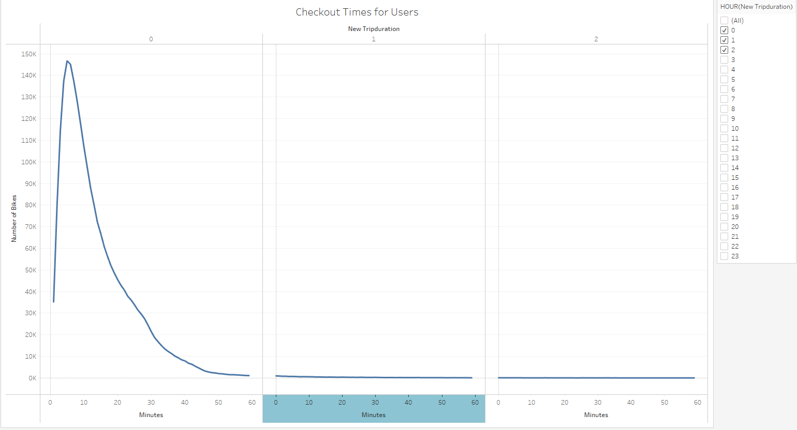
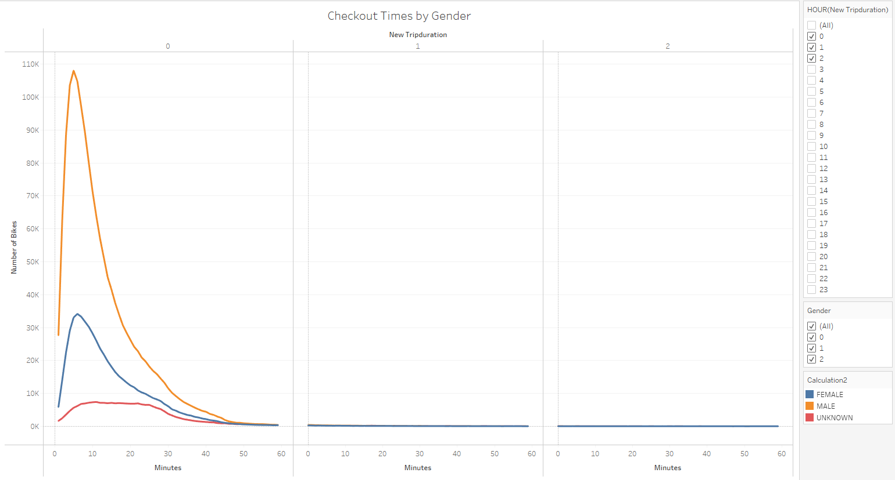
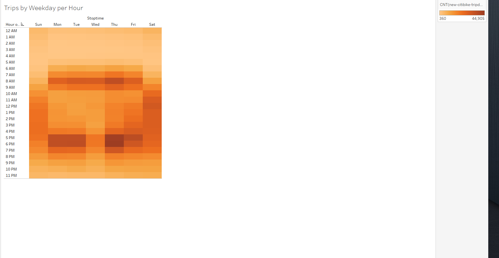
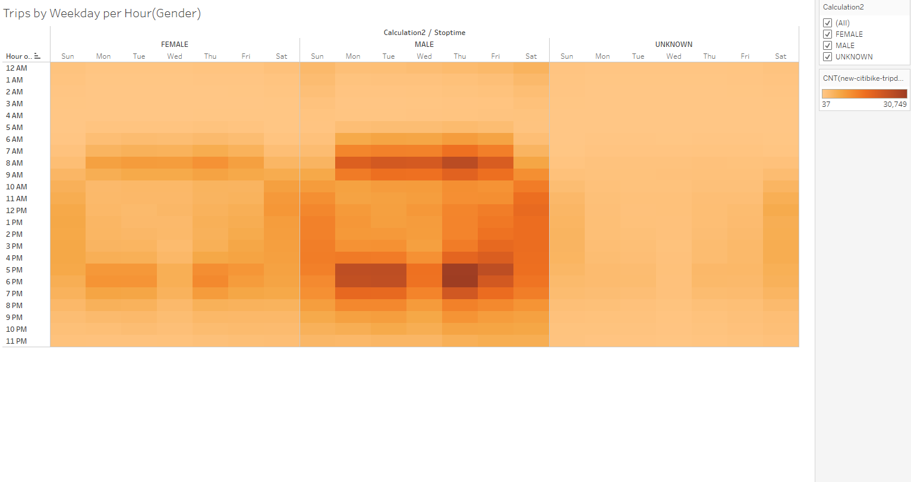
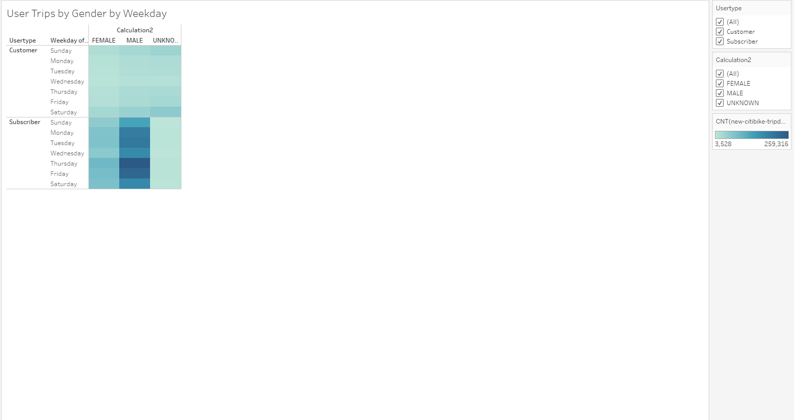
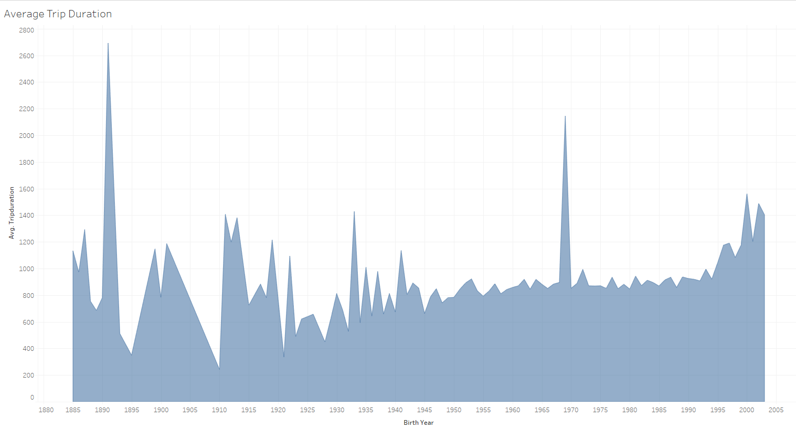
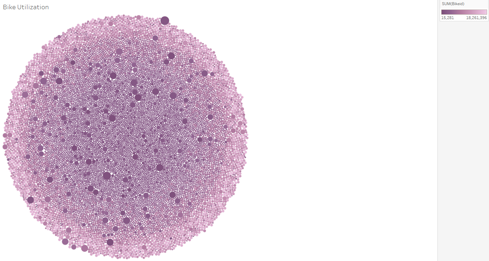

# Des Moines Bikeshare
## Project Overview
The purpose of this project was to analyze bikeshare data from New York City to help determine if the same business model could be applied to Des Moines, Iowa.

Visualizations of the data were created in a Tableau Story and published to Tableau Public here:
https://public.tableau.com/app/profile/paula.l.adams/viz/challenge14_16652027105330/MyBikeshareStory?publish=yes

## Results

### The Worksheet above displays the duration of bike rentals. A very large majority of rides lasted less than 60 minutes.

### This Worksheet shows the durations broken down by gender. 

### This heatmap shows the peak times per weekday.

### The above heatmap shows the peak time by weekday broken down by gender.

### This heatmap shows the trips by gender and customer type and indicates that male ***subscribers*** are the most frequent users of the service.

### The graph here shows the average duration of a trip by age. 

### This bubble map indicates bikes with the highest utilization.

## Summary

From the analysis we can tell that an overwhelming majority of users are male and the trips are more indicative of short trips rather that leisurely  tours. 
An analysis of winter usage could be helpful, as well as a breakdown of average price per trip.
